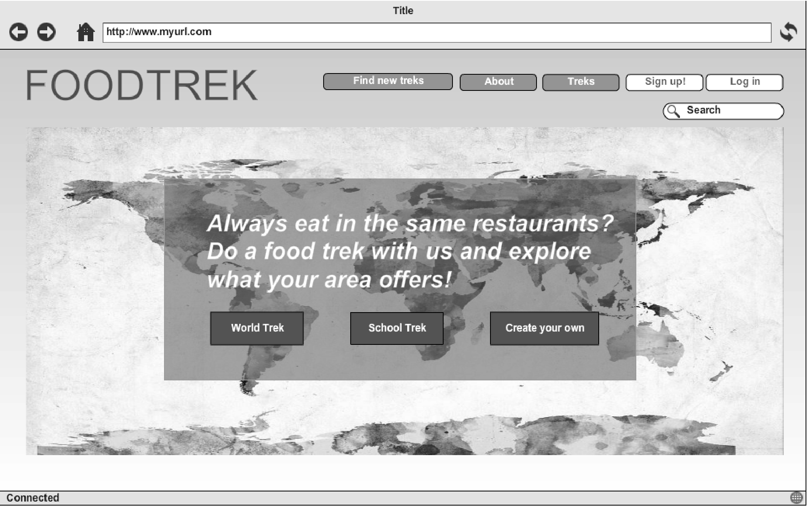
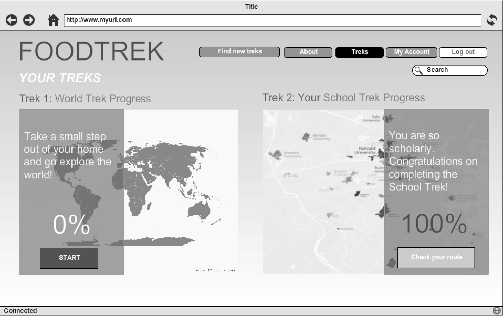
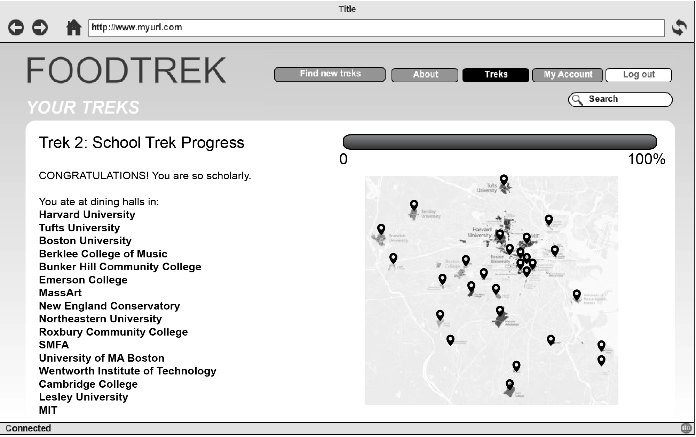
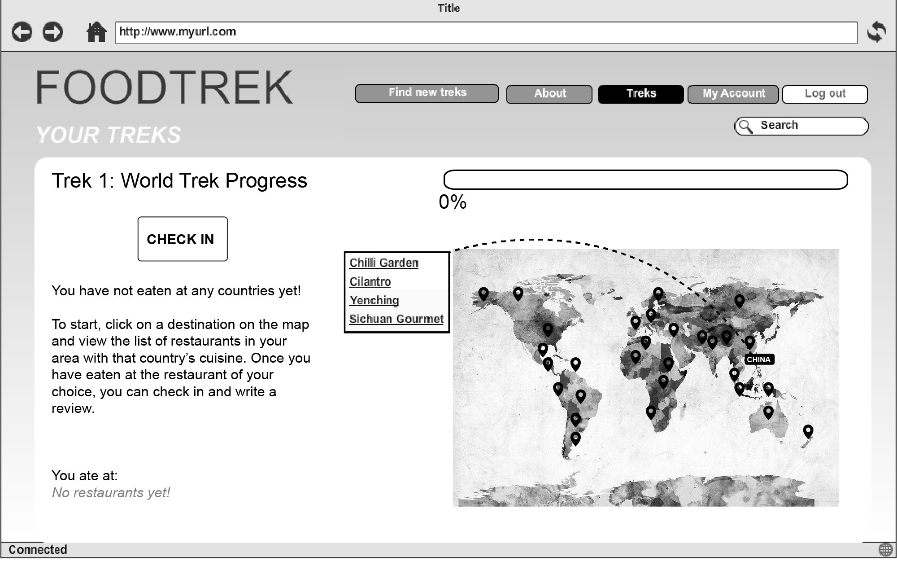
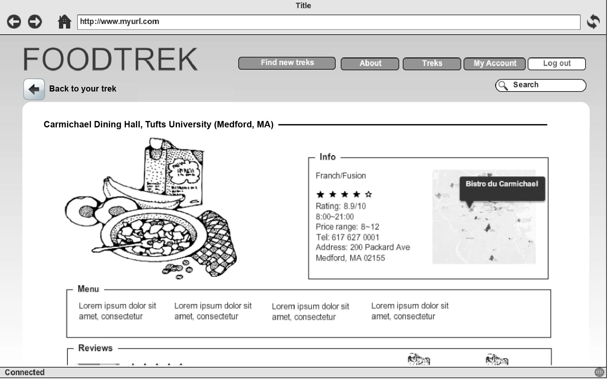
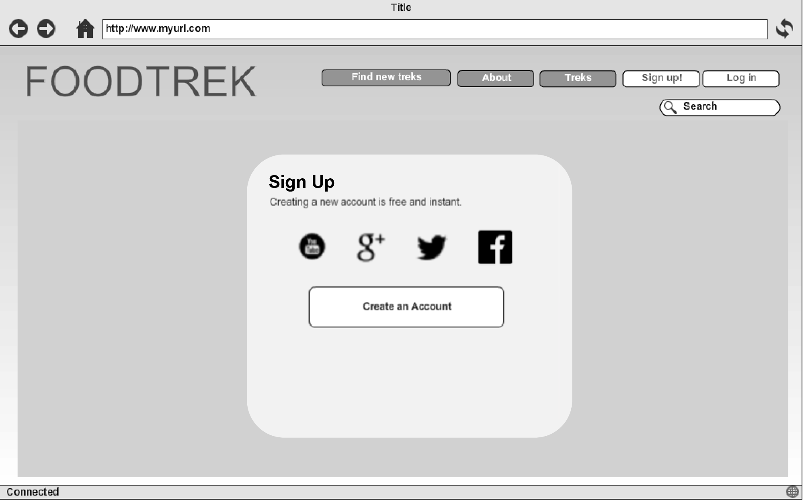
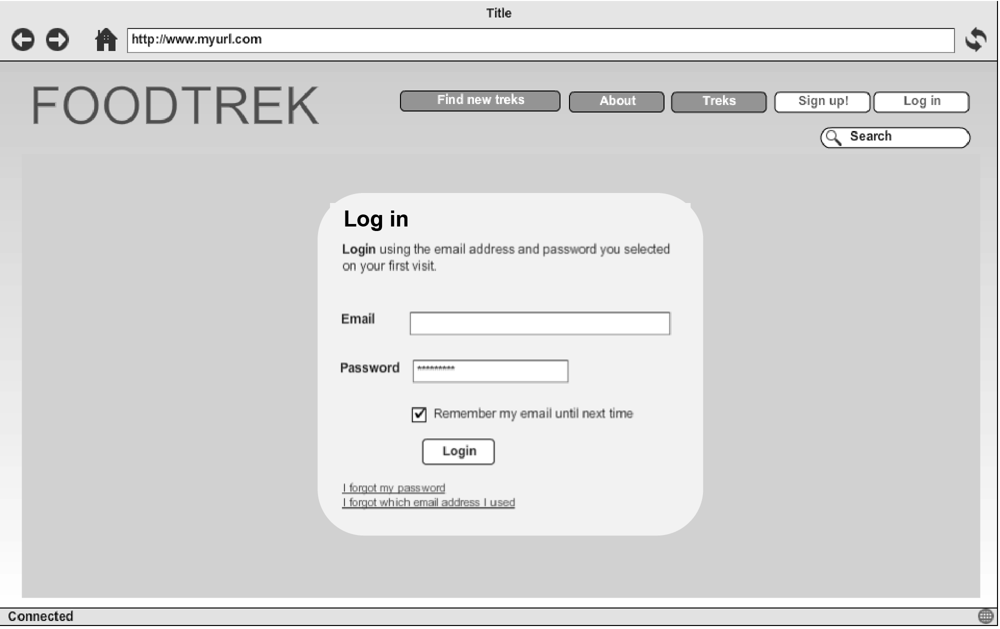

# FoodTrek 
	[link](http://foodtrek.herokuapp.com)
### Team members
* Tiancheng Li
* Mengtian Li
* Wanxin Cheng
* Feiyu Lu
* Val Ng

### Problem Statement 
People get stuck in their comfort zones with food. Many of us tend to go for the same options because we don’t know what are out there and how to explore them. FoodTrek gamify the exploration for food. Explore, get out of your comfort zone, get to know your city.

### Solutions
Our website FoodTrek provides users some fun food treks (i.e. quests in games). Users have to check in at all restaurants listed in the treks to finish a trek. The website provides two default theme: World Trek (explore different cultural foods from around world within the users’ city or neighborhood) and Univeristy Trek (make friends from different colleges in the area and eat in different university dining halls). Of course, users can create their own Treks to challenge other users. 

### Features 
- Geolocation (Google Map API & Bing -bing [API] to allow 50,000 free requests per day for geocoding)
- Server-side data persistence (PostgresSQL)
- Front-end framework (Bootstrap)
- Manage useraccount and email notification (Devise API) 
- Send emails, SMS, and push notifications (Action Mailer API)

### Data
- _Data generated by us:_
	- Two Default Treks - World Treks and University Treks (and their sections and restaurants)
- _Data generated by users:_
	- Check in information: geolocation and time

### Algorithms and Special Techniques
- Track Users' progress with the treks they joined.
- Automatically generate quest based on users input 

### Mockups (original design)

 

  

   

