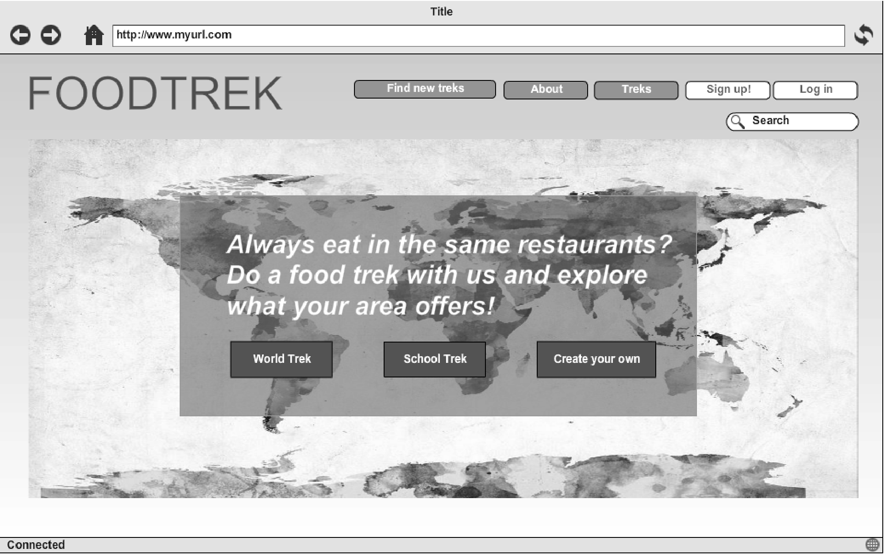
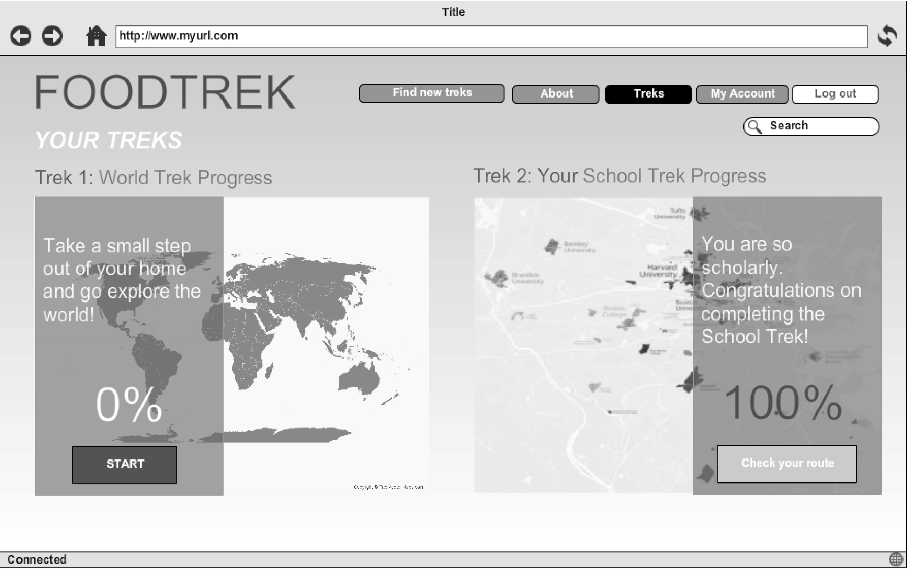
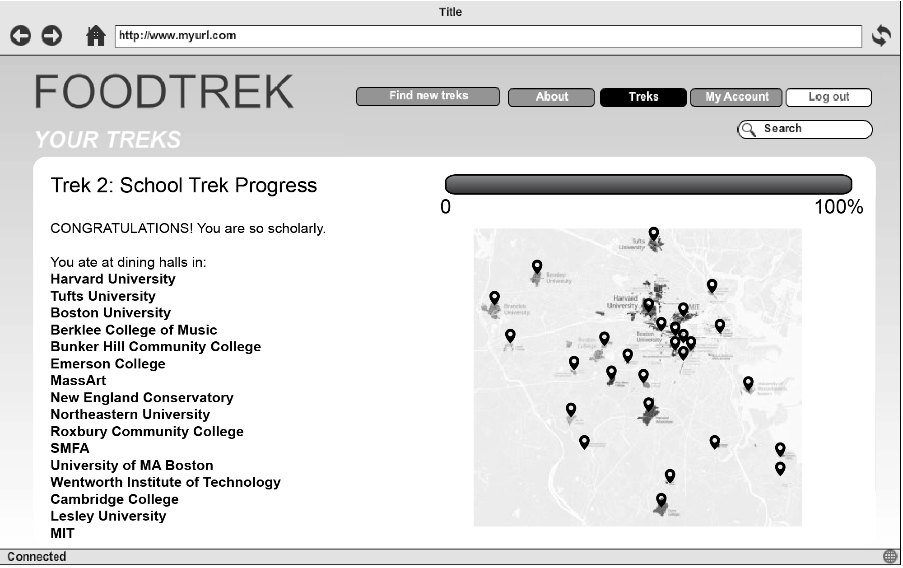
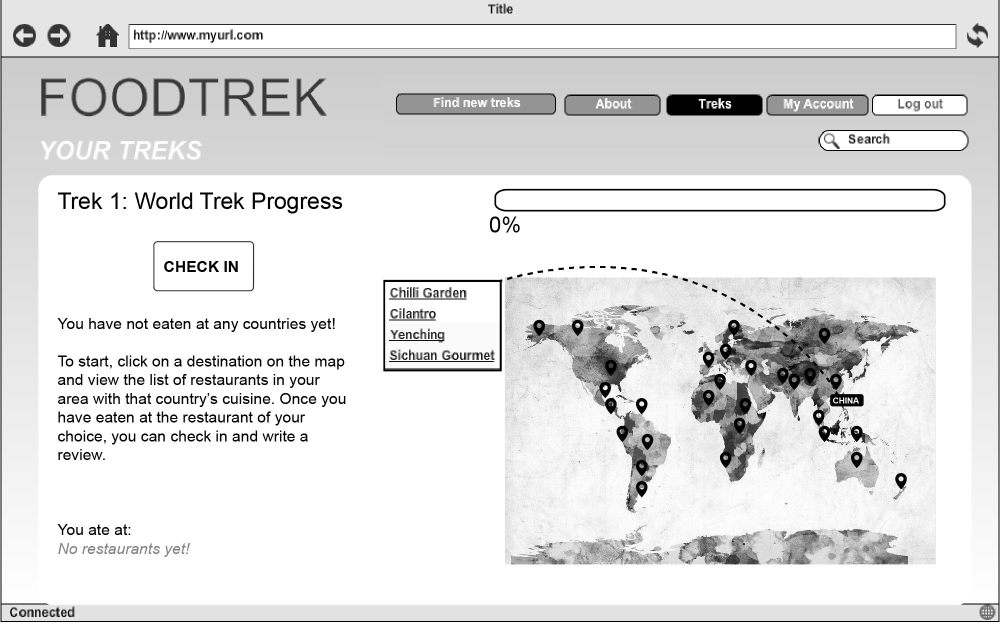
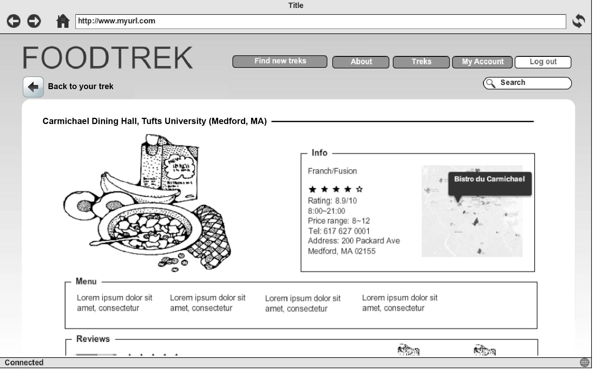
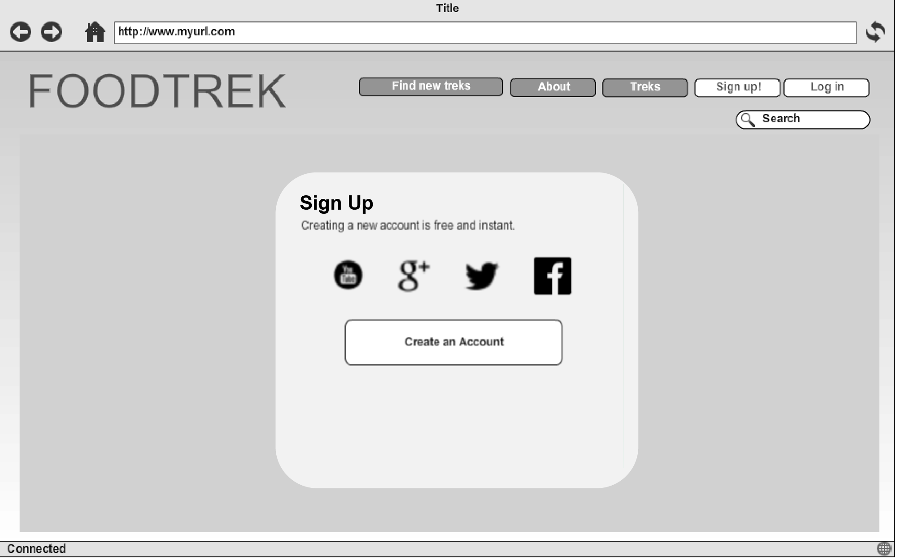
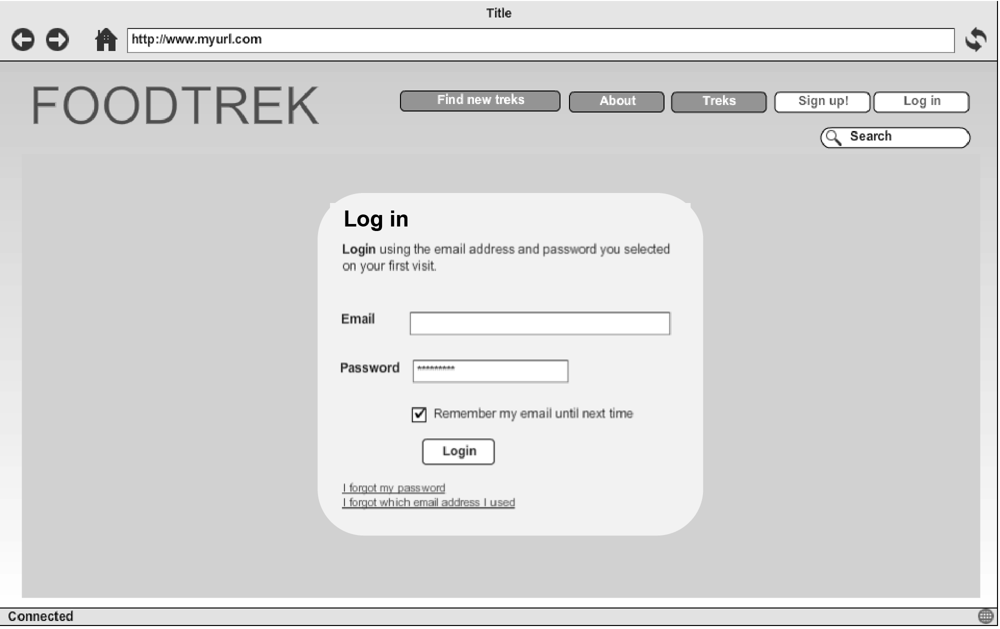

# FoodTrek 

### Problem Statement 
People get stuck in their comfort zones with regards to food. Many of us tend to navigate towards food we are comfortable and familiar with and go for the same options because we don’t know what other options are out there. FoodTrek encourages people to try new cuisines in a fun, interactive way. Explore, get out of your comfort zone, get to know your city.

### Solutions
Our website FoodTrek provides users some fun food quests (i.e. quests in games) to complete by eating at all restaurants listed in the treks. Sample Trek themes include World Trek (explore different cultural foods from around world within the users’ city or neighborhood) and School Trek (make friends from different colleges in the area and eat in different university dining halls). Of course, users can create their own Treks to challenge other users. 

### Features 
- Geolocation (Google Map API)
- Server-side data persistence (MongoDB)
- Front-end framework (Bootstrap)
- Reporting with charts and graphs (Google Charts API)
- Send emails, SMS, and push notifications

### Data
- _Data generated by us:_
	- List of restaurants and their basic information, including address, telephone number, website, open hours, genre, website, and menu. (Using [locu](https://locu.com) API)
	- Reviews and ratings of restaurants (from Yelp)
- _Data generated by users:_
	- Check in information: geolocation, pictures, and time
	- Feedback for restaurant you ate at + feedback for overall quest once completed

### Algorithms and Special Techniques
- Automatically generate quest lists of restaurants for different cities 
- Automatically generate maps that tracks progress of every user
- Confirming the validness of users’ check-in information 

### Mockups

 

  

   

#Comments by Ming
1. What you have listed for features are not features.  Briefly describe for what will you be using SMS, reporting, geolocation for.
2. Wireframes generally do not use pretty pictures
3. "Confirming the validness of users’ check-in information" --that will be very hard to do.
4. Overall: 13/15
